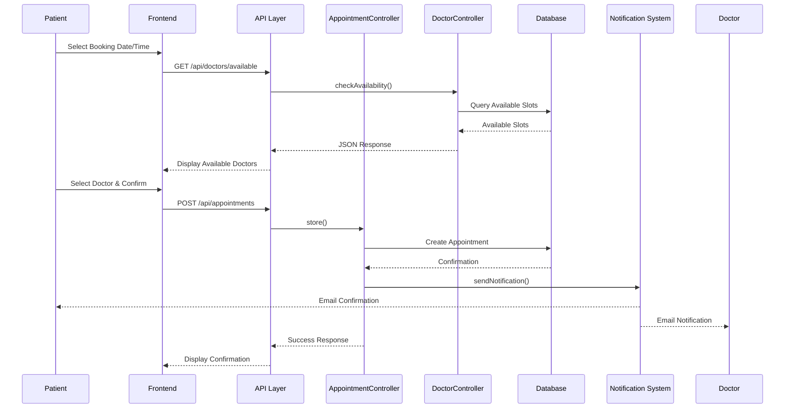
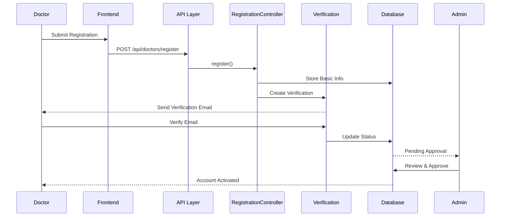
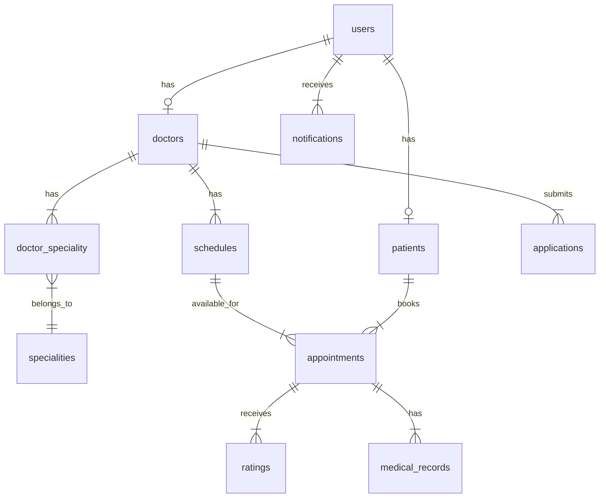

# Documentation Generation Plan for QuickCare

This document outlines the plan for generating comprehensive technical documentation for the QuickCare project.

## 1. Information Gathering Phase

-   Read key configuration files (`config/*.php`, `.env.example`).
-   Analyze routing files (`routes/web.php`, `routes/api.php`) to understand application endpoints and structure.
-   Examine database migrations (`database/migrations/`) for detailed schema information (columns, types, constraints, relationships).
-   List controllers (`app/Http/Controllers/`) and potentially analyze specific ones to understand business logic for features and API endpoints.
-   List middleware (`app/Http/Middleware/`) to understand request processing pipeline.
-   Check for existing `CONTRIBUTING.md` or similar files.
-   Analyze `app/Exceptions/Handler.php` for custom error handling logic.

## 2. Documentation Structure & Content Generation

### 2.1. Introduction

-   **Purpose:** Scheduling and management of medical appointments.
-   **Goals:** Improve efficiency and accessibility for patients and providers.
-   **Scope:** Define boundaries based on identified features (Admin, Doctor, Patient panels, Scheduling, Management, Notifications).
-   _(Source: README.md, further analysis)_

### 2.2. Features

-   Detail each feature listed in `README.md` (User Management, Appointment Scheduling, Doctor/Patient Management, Specialty Management, Notifications, Security).
-   Identify any additional features discovered during code analysis (e.g., Ratings, Doctor Applications based on models).
-   _(Source: README.md, Controllers, Routes, Views)_

### 2.3. Technology Stack

-   **Backend:** PHP 8.1+, Laravel 10.x, Composer.
-   **Frontend:** HTML, CSS, JavaScript, Tailwind CSS, Alpine.js, Vite, npm.
-   **Database:** MariaDB (as per README).
-   **Key Libraries (Backend):** `laravel/sanctum`, `barryvdh/laravel-dompdf`, `consoletvs/charts`, `laravel/breeze`, `stevebauman/location`.
-   **Key Libraries (Frontend):** `axios`, `flowbite`, `fullcalendar`, `perfect-scrollbar`.
-   **Development Tools:** Git, XAMPP/equivalent, Node.js.
-   _(Source: README.md, composer.json, package.json)_

### 2.4. System Architecture

-   Describe the MVC pattern implementation in Laravel.
-   Detail the request lifecycle (HTTP Request -> Web Server -> `public/index.php` -> Middleware -> Router -> Controller -> Model -> View -> HTTP Response).
-   Include a high-level architecture diagram using Mermaid:

    ```mermaid
    graph LR
        A[User Browser] -- HTTP Request --> B(Web Server - e.g., Apache/Nginx);
        B -- PHP Request --> C{PHP-FPM};
        C -- Laravel Bootstrap --> D[public/index.php];
        D -- Kernel --> E[HTTP Middleware];
        E -- Routing --> F[Router];
        F -- Dispatch --> G[Controller];
        G -- Interacts with --> H[Model];
        H -- Accesses --> I[(Database - MariaDB)];
        G -- Loads --> J[View - Blade Templates];
        J -- Compiles --> K[HTML/CSS/JS];
        C -- HTTP Response --> B;
        B -- HTTP Response --> A;

        L[Vite] -- Compiles Assets --> M[Public Assets];
        J -- Uses --> M;

        N[Task Scheduler] -- Runs --> O[Scheduled Jobs - e.g., UpdateAppointmentStatus];
        O -- Interacts with --> H;
        O -- Interacts with --> I;

        P[API Client] -- API Request --> B;
        F -- API Routing --> Q[API Controller];
        Q -- Interacts with --> H;
        Q -- Generates --> R[JSON Response];
        C -- API Response --> B;
        B -- API Response --> P;
        Q -- Uses Auth --> S[Sanctum];
    ```

#### 2.4.1 Key Workflows

##### Appointment Booking Sequence



##### Doctor Registration Flow



### 2.5. Database Schema

-   Document each table based on migrations (`users`, `addresses`, `patients`, `doctors`, `specialities`, `schedules`, `appointments`, `ratings`, `notifications`, `applications`, etc.).
-   Include columns, data types, constraints (nullable, unique, foreign keys).
-   Generate an ERD using Mermaid based on Model relationships and migrations. (This will be large, generated after analyzing migrations).
-   _(Source: app/Models, database/migrations)_



### 2.6. API Reference

-   Identify API endpoints from `routes/api.php`.
-   Document each endpoint: URL, HTTP Method, Description, Parameters (path, query, body), Request Format (JSON), Response Format (JSON), Authentication (Sanctum).
-   _(Source: routes/api.php, API Controllers, Sanctum config)_

### 2.7. Setup and Installation Guide

-   Refine steps from `README.md`.
-   List required PHP extensions.
-   Detail `.env` configuration based on `.env.example` and `config/` files (Database, Mail, App URL, etc.).
-   _(Source: README.md, .env.example, config/_)\*

### 2.8. Usage Instructions

-   Describe workflows for Admin, Doctor, and Patient roles.
-   Include screenshots or descriptions of key interfaces/actions (e.g., logging in, viewing dashboard, scheduling appointment, managing users).
-   Potentially add Use Case diagrams (Mermaid) for core actions.
-   _(Source: README.md, Controllers, Views)_

### 2.9. Deployment Procedures

-   Outline generic Laravel deployment steps (server requirements, cloning repo, installing dependencies, environment config, running migrations/seeds, optimizing, setting up queue worker/scheduler, web server config).
-   _(Source: Laravel best practices, potentially requires user input for specifics)_

### 2.10. Contribution Guidelines

-   Check for `CONTRIBUTING.md`. If absent, propose standard guidelines (fork/branch workflow, PR process, code style - mention `laravel/pint`).
-   _(Source: File existence check, standard practices)_

### 2.11. Troubleshooting

-   Common installation issues (permissions, dependencies, DB connection).
-   Runtime errors (check `storage/logs/laravel.log`, debug mode).
-   Tips based on `app/Exceptions/Handler.php`.
-   _(Source: Installation steps, Laravel knowledge, Handler.php)_

### 2.12 Security Considerations

-   Authentication Implementation
    -   Sanctum token-based authentication for API
    -   Session-based authentication for web interface
    -   Password policies and hashing
-   Authorization
    -   Role-based access control (Admin, Doctor, Patient)
    -   Resource-level permissions
-   Data Protection
    -   HTTPS enforcement
    -   SQL injection prevention
    -   XSS protection
    -   CSRF protection
-   Audit Trail
    -   Activity logging
    -   Error logging and monitoring
    -   Access logs

### 2.13 Performance Optimization

-   Caching Strategy
    -   Redis/Memcached configuration
    -   Query caching
    -   Route caching
-   Asset Optimization
    -   Vite bundling configuration
    -   Image optimization
    -   CSS/JS minification
-   Database Optimization
    -   Indexes
    -   Query optimization
    -   Database connection pooling

## 3. Review and Refinement

-   Organize all gathered information into a structured document (likely Markdown).
-   Ensure clarity, consistency, and accuracy.
-   Add cross-references where appropriate.
-   Format diagrams and code blocks correctly.
