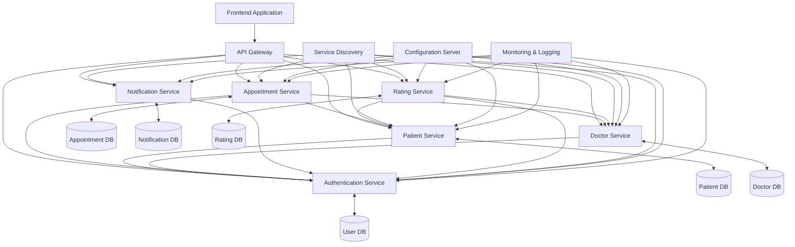

# QuickCare Microservices Architecture Plan

## Overview

This document outlines the plan to transform the QuickCare monolithic application into a modern, professional microservices architecture. The microservices approach will improve scalability, maintainability, and allow for independent development and deployment of different components of the system.

## Current Architecture

QuickCare is currently a monolithic Laravel application with the following key components:

-   **User Management**: Authentication, authorization, and user profiles (User model)
-   **Patient Management**: Patient records and appointments (Patient model related to User)
-   **Doctor Management**: Doctor profiles, schedules, and specialties (Doctor model related to User and Speciality)
-   **Appointment System**: Booking, scheduling, and management of appointments (Appointment model related to Patient, Doctor, and Schedule)
-   **Notification System**: Alerts and communications to users (Notification model related to User)
-   **Rating System**: Patient feedback for doctors (Rating model related to Patient and Doctor)

## Microservices Architecture

> Note: The arrows between services represent dependencies, where one service may need to communicate with another service to fulfill requests.

## Core Microservices

### 1. Authentication Service

**Responsibilities:**

-   User registration and authentication
-   Role-based access control
-   JWT token generation and validation
-   User profile management

**Technology Stack:**

-   Backend: Laravel (PHP)
-   Database: MySQL (relational database to maintain existing data structure)
-   Authentication: Laravel Sanctum/Passport for JWT tokens

**Key APIs:**

-   `POST /auth/register` - Register a new user
-   `POST /auth/login` - Authenticate a user
-   `GET /auth/profile` - Get user profile
-   `PUT /auth/profile` - Update user profile
-   `POST /auth/refresh-token` - Refresh authentication token

### 2. Patient Service

**Responsibilities:**

-   Patient profile management
-   Patient medical history
-   Patient address management

**Technology Stack:**

-   Backend: Laravel (PHP)
-   Database: MySQL (maintaining existing data structure)
-   ORM: Eloquent (Laravel's built-in ORM)

**Key APIs:**

-   `GET /patients` - List all patients (admin only)
-   `GET /patients/{id}` - Get patient details
-   `POST /patients` - Create a new patient
-   `PUT /patients/{id}` - Update patient information
-   `GET /patients/{id}/medical-history` - Get patient medical history

### 3. Doctor Service

**Responsibilities:**

-   Doctor profile management
-   Specialties management
-   Doctor availability and scheduling

**Technology Stack:**

-   Backend: Laravel (PHP)
-   Database: MySQL (maintaining existing data structure)
-   ORM: Eloquent (Laravel's built-in ORM)

**Key APIs:**

-   `GET /doctors` - List all doctors
-   `GET /doctors/{id}` - Get doctor details
-   `POST /doctors` - Create a new doctor (admin only)
-   `PUT /doctors/{id}` - Update doctor information
-   `GET /doctors/specialties` - List all specialties
-   `GET /doctors/specialties/{id}` - Get doctors by specialty

### 4. Appointment Service

**Responsibilities:**

-   Manage doctor schedules
-   Query availability
-   Book appointments
-   Manage appointments (update status, cancel, etc.)

**Technology Stack:**

-   Backend: Laravel (PHP)
-   Database: MySQL (maintaining existing data structure)
-   ORM: Eloquent (Laravel's built-in ORM)

**Key APIs:**

-   `POST /schedules` - Create a new schedule slot
-   `GET /availability` - Get available time slots
-   `POST /appointments` - Book a new appointment
-   `GET /appointments` - List appointments (filtered by patient or doctor)
-   `PUT /appointments/{id}/status` - Update appointment status

### 5. Notification Service

**Responsibilities:**

-   Send email notifications
-   Send SMS notifications
-   In-app notifications
-   Notification preferences management

**Technology Stack:**

-   Backend: Laravel (PHP)
-   Database: MySQL (maintaining existing data structure)
-   Message Queue: Laravel Queue with Redis driver
-   ORM: Eloquent (Laravel's built-in ORM)

**Key APIs:**

-   `POST /notifications` - Create a new notification
-   `GET /notifications` - Get user notifications
-   `PUT /notifications/{id}/read` - Mark notification as read
-   `PUT /notifications/preferences` - Update notification preferences

### 6. Rating Service

**Responsibilities:**

-   Manage patient ratings for doctors
-   Calculate average ratings
-   Review moderation

**Technology Stack:**

-   Backend: Laravel (PHP)
-   Database: MySQL (maintaining existing data structure)
-   ORM: Eloquent (Laravel's built-in ORM)

**Key APIs:**

-   `POST /ratings` - Create a new rating
-   `GET /ratings/doctor/{id}` - Get ratings for a doctor
-   `GET /ratings/patient/{id}` - Get ratings by a patient
-   `PUT /ratings/{id}` - Update a rating

## Infrastructure Components

### 1. API Gateway

**Responsibilities:**

-   Route requests to appropriate microservices
-   Authentication and authorization
-   Rate limiting
-   Request/response transformation
-   Load balancing

**Technology:**

-   Laravel API Gateway package or Kong (with Laravel integration)

### 2. Service Discovery

**Responsibilities:**

-   Register and discover services
-   Health checking
-   Load balancing

**Technology:**

-   Laravel Service Discovery package or Consul with PHP client

### 3. Configuration Server

**Responsibilities:**

-   Centralized configuration management
-   Environment-specific configurations

**Technology:**

-   Laravel configuration with environment variables or Consul with PHP client

### 4. Monitoring & Logging

**Responsibilities:**

-   Centralized logging
-   Performance monitoring
-   Alerting

**Technology:**

-   ELK Stack (Elasticsearch, Logstash, Kibana)
-   Prometheus and Grafana

## Frontend Application

**Responsibilities:**

-   User interface for all system functionalities
-   Responsive design for mobile and desktop
-   Modern and professional UI/UX

**Technology Stack:**

-   Framework: React.js with Next.js
-   UI Library: Material-UI or Tailwind CSS
-   State Management: Redux or Context API
-   API Client: Axios

## Containerization and Orchestration

**Technology:**

-   Containerization: Docker
-   Orchestration: Kubernetes
-   CI/CD: Jenkins or GitHub Actions

## Implementation Strategy

### Phase 1: Preparation and Planning

1. **Detailed Service Design**

    - Define exact API contracts for each service
    - Design database schemas based on existing Laravel models
    - Define service interactions and dependencies
    - Document data ownership boundaries between services

2. **Infrastructure Setup**
    - Set up Docker for containerization
    - Configure CI/CD pipelines for automated testing and deployment
    - Set up monitoring and logging infrastructure
    - Implement API Gateway as the entry point for all services

### Phase 2: Strangler Pattern Implementation

1. **Authentication Service**

    - Extract User model and authentication logic into a separate Laravel service
    - Implement JWT token-based authentication using Laravel Sanctum/Passport
    - Redirect authentication requests from the monolith to the new service
    - Gradually migrate user data while maintaining backward compatibility

2. **Patient and Doctor Services**

    - Extract Patient and Doctor models and related functionality
    - Implement service-to-service communication with the Authentication Service
    - Create APIs that mirror the existing functionality
    - Update the monolith to use these services instead of direct database access

3. **Appointment Service**
    - Extract Appointment and Schedule models and related functionality
    - Implement service-to-service communication with Patient and Doctor Services
    - Maintain data consistency across services during the transition period

### Phase 3: Supporting Services and Integration

1. **Notification Service**

    - Implement notification mechanisms
    - Integrate with other services

2. **Rating Service**

    - Implement rating functionality
    - Migrate existing ratings

3. **API Gateway**
    - Configure routing
    - Implement authentication middleware

### Phase 4: Frontend and Final Integration

1. **Frontend Application**

    - Develop new UI with modern design
    - Integrate with API Gateway

2. **Testing and Optimization**

    - End-to-end testing
    - Performance optimization

3. **Deployment**
    - Deploy to production environment
    - Monitor and fix issues

## Benefits of Microservices Architecture

1. **Scalability**: Each service can be scaled independently based on demand.
2. **Resilience**: Failure in one service doesn't affect others.
3. **Technology Diversity**: Different services can use different technologies best suited for their specific requirements.
4. **Independent Development**: Teams can work on different services simultaneously.
5. **Easier Maintenance**: Smaller codebases are easier to understand and maintain.
6. **Faster Deployment**: Smaller services can be deployed more quickly and with less risk.

## Challenges and Mitigations

1. **Complexity**

    - **Challenge**: Distributed systems are inherently more complex.
    - **Mitigation**: Proper documentation, service discovery, and monitoring.

2. **Data Consistency**

    - **Challenge**: Maintaining data consistency across services.
    - **Mitigation**: Implement event-driven architecture and eventual consistency where appropriate.

3. **Network Latency**

    - **Challenge**: Communication between services introduces latency.
    - **Mitigation**: Optimize API calls, implement caching, and consider data duplication where necessary.

4. **Deployment Complexity**
    - **Challenge**: Managing deployment of multiple services.
    - **Mitigation**: Automate deployment with CI/CD pipelines and containerization.

## Conclusion

Transforming QuickCare into a microservices architecture will provide significant benefits in terms of scalability, maintainability, and development velocity. While there are challenges associated with this transformation, they can be mitigated with proper planning and implementation strategies. The proposed architecture provides a modern, professional foundation for the future growth of the QuickCare platform.
